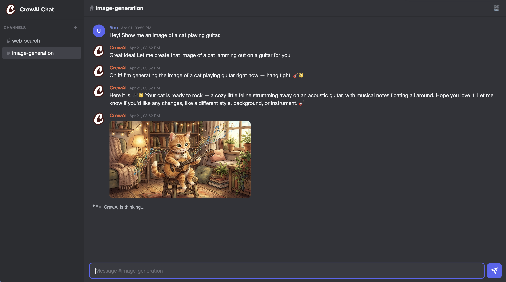
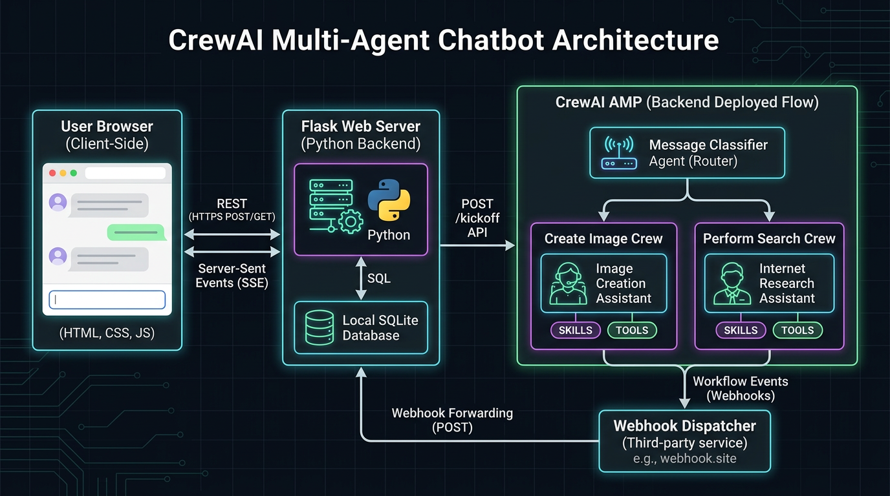

# Multi-Agent Chatbot



A conversational chatbot built with [CrewAI Flows](https://docs.crewai.com), deployed to [CrewAI AMP](https://docs.crewai.com/en/enterprise), with a Discord-style web UI driven by Flask and vanilla JS.

## Architecture



### Request lifecycle

1. User types a message in the browser.
2. Flask saves it to SQLite, returns `202`, and fires a background `POST /kickoff` to AMP with the channel's `conversation_id` as the flow state `id` + `user_message`.
3. AMP runs the `ConversationalFlow` — `@persist()` restores the state (including prior `messages`) using the flow's `id`, appends the new user message, and hands off to the `MessageClassifierAgent`.
4. The classifier categorizes the message and either responds directly (for simple queries) or routes the flow to the `ImageCreationCrew` or `InternetSearchCrew`.
5. The active agent reasons over the conversation and calls tools (`SendMessageToUser`, `NanoBananaImageGeneration`, etc.). Each tool emits events through the `ConversationalEventBus`.
6. The `ConversationalEventListener` catches those events (`LLMStreamChunkEvent`, `LLMThinkingChunkEvent`, `ToolUsageStartedEvent`, `ToolUsageFinishedEvent`, `ToolUsageErrorEvent`, `ImageGenerated`, `FlowFinishedEvent`), stamps them with `conversation_id`, and dispatches them to `webhook.site` via the `Dispatcher` client.
7. `webhook.site` XHR-redirects each event to the Flask server's `/api/webhook` endpoint.
8. Flask persists each event immediately as it arrives (thinking chunks via upsert, tool usage and messages as individual rows) and broadcasts all events to connected browsers via SSE.

## Back-End (`src/template_multi_agent_chatbot/`)

### Flow — `main.py`

`ConversationalFlow` is a CrewAI `Flow[ConversationalState]` with two steps:


| Step                   | Decorator                                                                    | What it does                                                                                               |
| ---------------------- | ---------------------------------------------------------------------------- | ---------------------------------------------------------------------------------------------------------- |
| `load_initial_context` | `@start()`                                                                   | Registers the event listener and appends the new user message to state.                                    |
| `classify_message`     | `@router(load_initial_context)`                                              | Runs `MessageClassifierAgent` to determine intent ("SIMPLE", "IMAGE_CREATION_UPDATE", "INTERNET_SEARCH").  |
| `handle_image_creation`| `@listen("IMAGE_CREATION_UPDATE")`                                           | Instantiates and executes the `ImageCreationCrew`.                                                         |
| `handle_internet_search`| `@listen("INTERNET_SEARCH")`                                                | Instantiates and executes the `InternetSearchCrew`.                                                        |
| `handle_simple_message`| `@listen("SIMPLE")`                                                          | No-op, the classifier handles direct responses for simple queries.                                         |
| `finalize`             | `@listen(or_(handle_simple_message, handle_image_creation, handle_internet_search))` | Returns the serialized state to finish the flow.                                                           |

The flow is decorated with `@persist()`, which automatically saves and restores `ConversationalState` across kickoffs using the flow state's `id` (a UUID passed by the UI as the conversation identifier). State fields: `user_message` and `messages` (the full conversation history, accumulated over time).

### Classification & Routing

**`agents/message_classifier_agent.py`**
- **Agent**: `Message Classifier` powered by `gemini/gemini-3.1-flash-lite-preview`.
- **Skills**: `skills/` (discovers `user-communication` and other relevant skills).
- **Role**: Triage the request, emit a quick "routing" acknowledgement using `SendMessageToUserTool`, and return a `ClassificationResult` which controls the Flow router. If the request is simple, it answers the user directly via the tool.

### Crews

**`crews/image_creation_crew.py`**
- **Agent**: `CrewAI Image Creation Assistant` powered by `gemini/gemini-3.1-pro-preview`, equipped with image tools.
- **Skills**: `skills/user-communication`, `skills/image-generation`.
- **Task**: Interpret the request, generate/edit images via Gemini, and communicate progress using the `SendMessageToUserTool`.

**`crews/internet_search_crew.py`**
- **Agent**: `CrewAI Internet Research Assistant` powered by `gemini/gemini-3.1-pro-preview`, equipped with internet search/scraping tools.
- **Skills**: `skills/user-communication`, `skills/internet-searching`.
- **Task**: Formulate search queries, evaluate findings, and synthesize clear answers with sources using the `SendMessageToUserTool`.

### Tools


| Tool                                  | Description                                                                                                                                      |
| ------------------------------------- | ------------------------------------------------------------------------------------------------------------------------------------------------ |
| `SendMessageToUserTool`               | Appends the agent's reply to flow state. Content reaches the user via `llm_stream_chunk` events and is persisted on `tool_usage_finished`.        |
| `NanoBananaImageGenerationTool`       | Generates an image via Gemini (`gemini-3.1-flash-image-preview`), emits an `ImageGenerated` (base64) event.                                      |
| `NanoBananaImageEditingTool`          | Edits an existing image via Gemini with a text prompt, same event pattern as generation.                                                         |
| `SerperDevTool` / `ScrapeWebsiteTool` | Web search and scraping (from `crewai_tools`).                                                                                                   |


### Event System

The event system is the bridge between the CrewAI agent running in AMP and the external UI.

**Custom event types** (`events/types/`):

- `ImageGenerated` — carries `result.image` (base64-encoded PNG).

`**ConversationalEventBus`** (`events/conversational_event_bus.py`):

- Wraps the CrewAI event bus. Tools call `append_message()` / `emit_image_generated()` on it.
- Appends messages to flow state (persisted automatically by `@persist()`).

`**ConversationalEventListener**` (`events/listeners/conversational_event_listener.py`):

- A `BaseEventListener` that subscribes to `ImageGenerated`, `LLMStreamChunkEvent`, `LLMThinkingChunkEvent`, `FlowFinishedEvent`, `ToolUsageStartedEvent`, `ToolUsageFinishedEvent`, and `ToolUsageErrorEvent`.
- Stamps each event with `source_fingerprint` and `fingerprint_metadata.conversation_id`.
- Dispatches every event to the external webhook via the `Dispatcher` client.

`**Dispatcher**` (`events/clients/dispatcher.py`):

- Simple HTTP POST client that sends JSON event payloads to `DISPATCHER_URL` (webhook.site) with bearer auth.

## UI (`ui_template_multi_agent_chatbot/`)

Flask app with a Discord-inspired dark theme.

- **Channels**: each channel maps to a `conversation_id` (UUID generated on creation). Multiple concurrent conversations.
- **SQLite** (`db/chatbot.db`): stores channels and messages with `event_id`-based deduplication. Thinking chunks are upserted incrementally; tool usage and assistant messages are persisted immediately as individual rows.
- **SSE**: each browser tab subscribes to `/api/channels/<id>/events` for real-time updates.
- **Webhook receiver** (`POST /api/webhook`): receives events forwarded from webhook.site, matches them to channels via `fingerprint_metadata.conversation_id`, persists each event immediately to SQLite, and broadcasts to connected browsers via SSE.
- **Frontend** (`static/js/app.js`): renders messages with markdown support (via `marked.js`), displays base64 images inline, shows agent thinking as faded inline messages (togglable via "Show Thoughts"), displays tool usage with inline wrench icons ("Using X..." → "Used X for Ns"), and shows a "CrewAI is executing your request..." banner during active flows.

## Setup

**Requirements**: Python >= 3.10, < 3.14 · [uv](https://docs.astral.sh/uv/) · [ngrok](https://ngrok.com/) (with `crewai-chatbot.ngrok.io` domain)

1. Copy `.env.example` to `.env` and fill in the keys:

  | Key                 | Purpose                                                  |
  | ------------------- | -------------------------------------------------------- |
  | `GEMINI_API_KEY`    | LLM (classifier, crews) and image generation / editing   |
  | `SERPER_API_KEY`    | Web search via Serper                                    |
  | `DISPATCHER_URL`    | Webhook.site endpoint for event forwarding               |
  | `DISPATCHER_KEY`    | Bearer token for the dispatcher                          |
  | `DEPLOYMENT_URL`    | CrewAI AMP deployment URL                                |
  | `DEPLOYMENT_KEY`    | CrewAI AMP API key                                       |

2. Deploy the flow to CrewAI AMP:
  ```bash
   crewai deploy
  ```
3. Configure `webhook.site` to XHR-redirect incoming events to `https://crewai-chatbot.ngrok.io/api/webhook`.
4. Start the UI:
  ```bash
   bin/start
  ```
   This installs dependencies, wakes up AMP, starts Flask on port 5005, and opens an ngrok tunnel.
5. Open `http://localhost:5005` (or `https://crewai-chatbot.ngrok.io`), create a channel, and start chatting.

